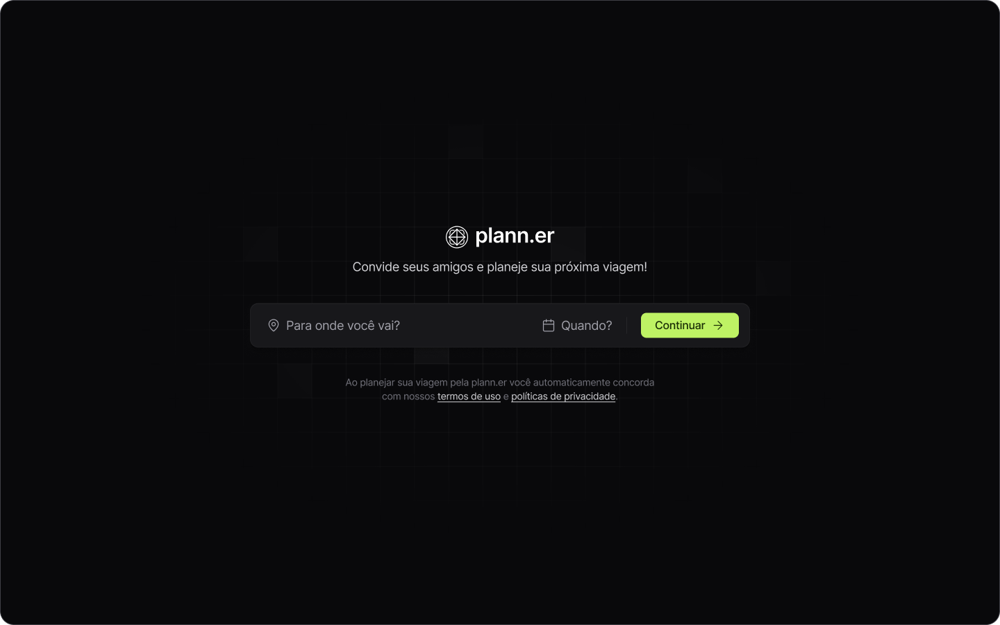
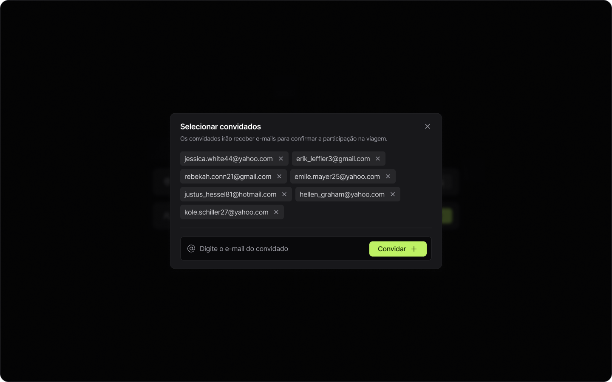
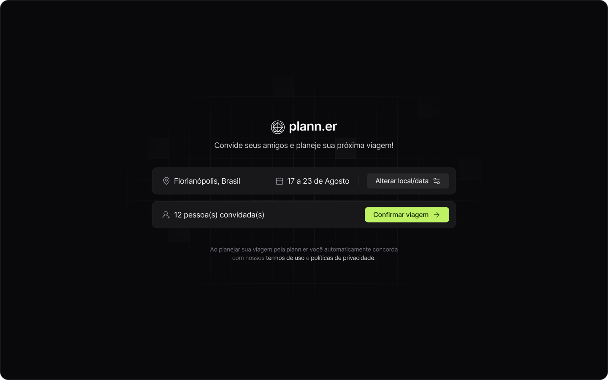
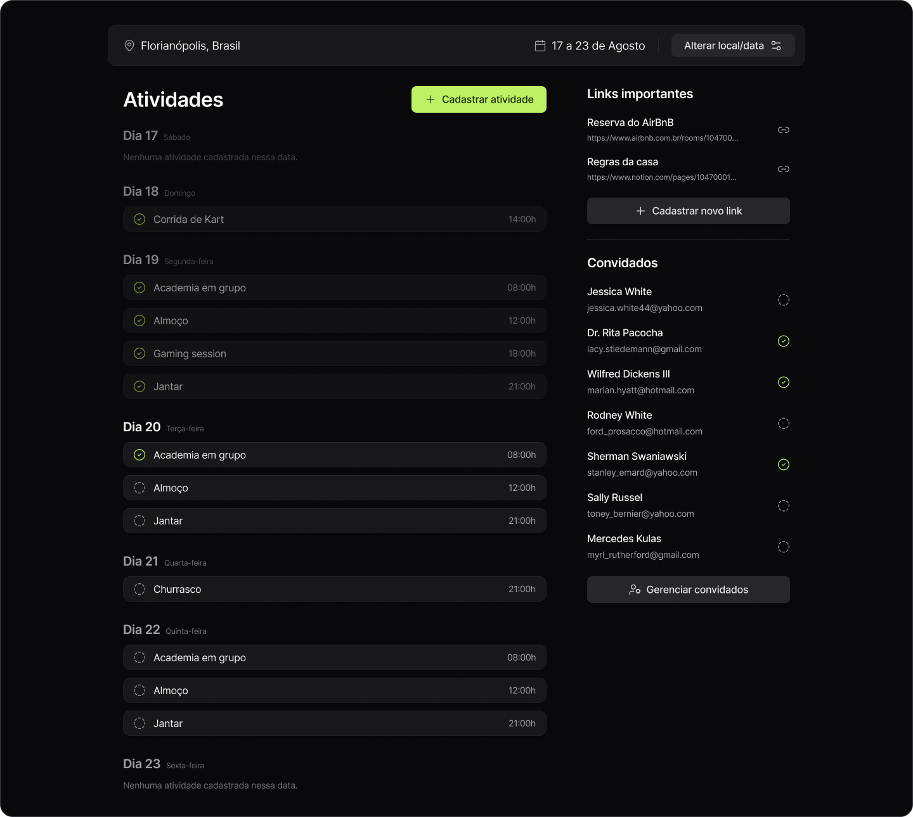
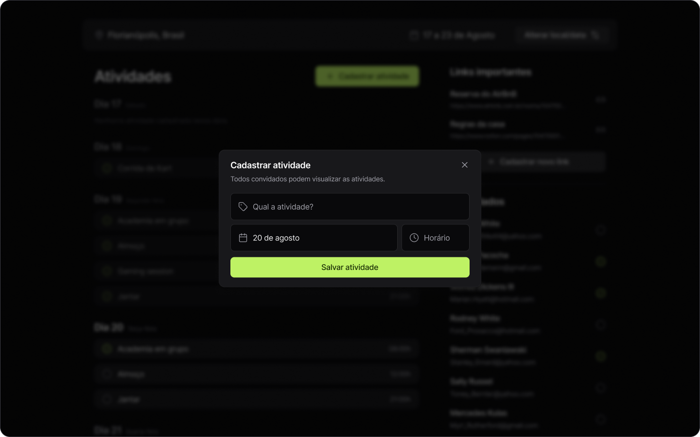
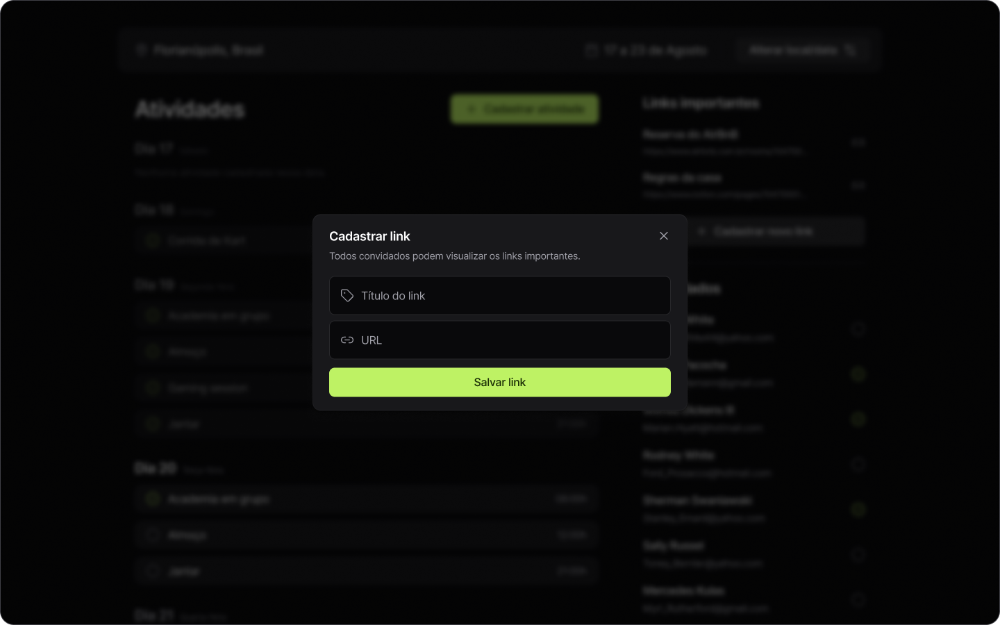
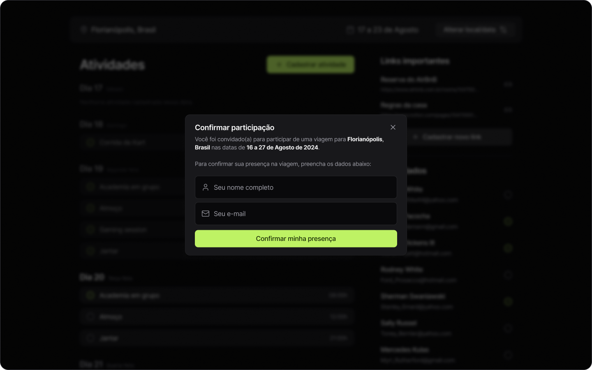

<h1 align="center" style="font-weight: bold;">Plann.er</h1>

<p align="center">
  <a href="#tech">Tecnologias</a> •
  <a href="#about">Sobre</a> •
  <a href="#started">Começando</a> •
  <a href="#colab">Colaboradores</a> •
  <a href="#contribute">Contribuir</a>
</p>

<p align="center">
    <b>Plann.er é uma plataforma inovadora desenvolvida para ajudá-lo a planejar suas viagens, criar checklists e convidar amigos para participar.</b>
</p>

<h2 id="layout">Layout</h2>

<p align="center"></p>

<h2 id="tech">Tecnologias</h2>

<h4>Back-End</h4>

- [Node.JS](https://devdocs.io/node) - Responsável pela lógica de interação e funcionalidades da aplicação.
- [TypeScript](https://devdocs.io/typescript/) - Um superconjunto de JavaScript que adiciona tipagem estática ao código, ajudando a identificar erros durante o desenvolvimento e proporcionando um código mais robusto e fácil de manter.

<h3>Bibliotecas e Ferramentas</h3>

<h4>Back-End</h4>

- [SQLite](https://devdocs.io/sqlite/) - Banco de dados leve e eficiente.
- [Prisma](https://www.prisma.io/docs) - ORM para facilitar a interação com o banco de dados.
- [Fastify](https://fastify.dev/docs/latest/) - Framework web rápido e de baixo overhead.
- [Fastify Cors](https://github.com/fastify/fastify-cors) - Plugin do Fastify para habilitar CORS (Cross-Origin Resource Sharing).
- [Fastiify Type Provider Zod](https://github.com/turkerdev/fastify-type-provider-zod) -  Plugin para integração de tipagem com ZOD no Fastify.
- [TSX](https://tsx.is/) - Ferramenta para executar e compilar código TypeScript.
- [Nodemailer](https://nodemailer.com/) - Envio de e-mails.
- [DayJS](https://day.js.org/docs/en/installation/node-js) - Manipulação de datas.
- [ZOD](https://zod.dev/) - Validação de dados.

<h2 id="about">Sobre</h2>

<p>Plann.er é uma plataforma inovadora desenvolvida para ajudá-lo a planejar suas viagens, criar checklists e convidar amigos para participar. Com Plann.er, você pode agendar suas viagens, criar listas de tarefas e enviar convites aos seus amigos, recebendo confirmações de participação diretamente por e-mail.</p>

<p>Plann.er foi desenvolvido como parte do evento NLW Journey da Rocketseat. O foco principal do projeto é fornecer uma solução completa para o planejamento de viagens, facilitando a organização e comunicação entre os participantes.</p>

<h3>Funcionalidades</h3>

Planner oferece uma série de funcionalidades para otimizar o planejamento das suas viagens:

- **Envio de e-mails para a confirmação da viagem pelo participante:** Após convidar amigos, eles recebem um e-mail para confirmar sua participação.
- **Envio de e-mails para a confirmação do dono da viagem:** O organizador da viagem recebe um e-mail para confirmar a viagem.
- **Checklists:** Crie e gerenciar listas de tarefas do que fazer durante a viagem.

<h2 id="started">🚀 Começando</h2>

1. **Clone este repositório:**  

```bash  
git clone https://github.com/vdonoladev/plann.er.git  
```  
  
2. **Navegue até o diretório do projeto:**  

```bash  
cd plann.er 
```  

**MAIS INFORMAÇÕES EM BREVE!**

<h2 id="colab">Colaboradores</h2>

Agradecimento especial a todas as pessoas que contribuíram para este projeto.

<table>
  <tr>
    <td align="center">
      <a href="#">
        <br>
        <sub>
          <b>Víctor Donola Ferreira</b>
        </sub>
      </a>
    </td>
  </tr>
</table>

<h2 id="contribute">Contribuir</h2>

1. `git clone https://github.com/vdonoladev/plann.er.git`
2. `git checkout -b feature/NAME-OF-FEATURE`
3. Siga os **Commit Patterns**
4. Abra um **Pull Request** explicando o problema resolvido ou o recurso feito, se houver, anexe a captura de tela das modificações visuais e aguarde a revisão!

<h3>Documentações que podem ajudar</h3>

- [📝 How to create a Pull Request](https://www.atlassian.com/br/git/tutorials/making-a-pull-request)

- [💾 Commit pattern](https://gist.github.com/joshbuchea/6f47e86d2510bce28f8e7f42ae84c716)

<h2 id="layout">Layout</h2>

<h3>Nova viagem</h3>

<p align="center"></p>

<h3>Pessoas</h3>

<p align="center"></p>

<h3>Convidar</h3>

<p align="center"></p>

<h3>Finalizar</h3>

<p align="center"></p>

<h3>Confirmar</h3>

<p align="center"></p>

<h3>Detalhes da viagem</h3>

<p align="center"></p>

<h3>Nova atividade</h3>

<p align="center"></p>

<h3>Novo link</h3>

<p align="center"></p>

<h3>Confirmar participação</h3>

<p align="center"></p>
